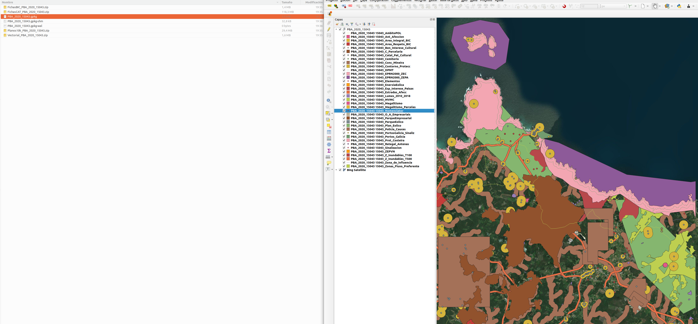
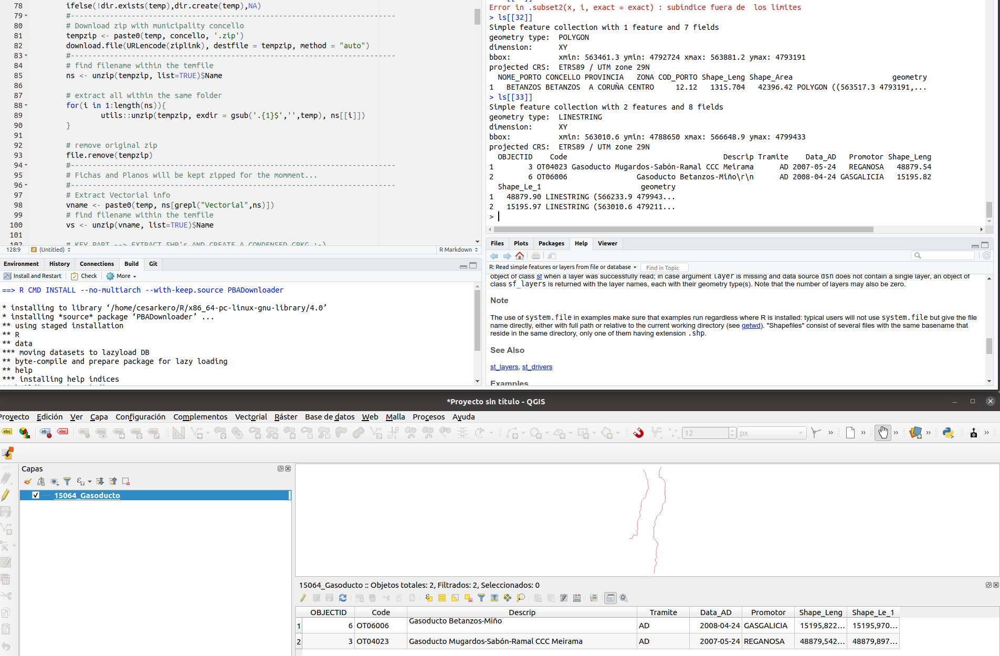

PBADownloader 0.1.0
================
2021-02-01

# Corrections

None for the moment…

# Description

This library helps the user to create a single library with all the
files within the Plan Básico Autonómico (PBA) of Galicia. There already
exist a webmap where geodata and maps from each municipality can be
downloaded. However, this web site just allows the user to download
municipalities individualy and restricting to a maximum of 6
simultaneous downloads. With this tools you can:

  - Download the PBA for a list of concellos (municipalities) without
    taking care of the server restrictions as they are already
    implemented.
  - Download the PBA for the 313 concellos in just one execution.
  - Create a structured directory with all the concellos and their
    respective original .zip files, where maps and other complementary
    information will be stored.
  - Create a single file (.gpkg) will all the geographic information
    downloaded.
      - Each layer contains in their name they origin and category of
        information, what facilitates representation.

# Installation

This packages has been tested in:

  - Ubuntu 20.04 with R 4.0.3
  - Windows 10 with R 4.0 + Rtools 4.0

Install dependencies (libraries) in R:

``` r
# install libraries to install packages from github
install.packages("devtools"); library(devtools)

install_github("cesarkero/PBADownloader")
```

# Before try out

Please, use this library using your brain. Download just what you need
and avoid constant masive downloads as it will produce overload in
public servers and this can lead to restrictions for the general public.
So please, be kind with the service and let us all enjoy this data. For
sure, don’t try parallel for masive downloads until you have checked
that this is a useful tool to you.

Moreover, if you just need the layers for a single or a few
municipalities, just use the web [Plan Básico
Autonómico](http://mapas.xunta.gal/visores/descargas-pba/).

[](http://mapas.xunta.gal/visores/descargas-pba/)

ENJOY DATA

# Examples

## Single Province download

The library already contains the data with the names and composed urls.
Just load it and show it to get the name of the desired municipality. It
works also with a list of municipalities. Be patient as the function
contains an sleep of 60s between executions in order to avoid crushing
server.

``` r
#-------------------------------------------------------------------------------
# PARAMETERS
# read data
data("pbaurls")
outdir <- '../02_OUTPUT/'

# show municipalities available
pbaurls$Concello

#-----------------------------------------------------------------------
# Single execution
PBADownloader("Beade", outdir, pbaurls)

# Single execution in a serie of municipalities (on by one)
concellos <- list("Paderne", "Pol","A Peroxa")
lapply(concellos, PBADownloader, outdir)

# Download all
concellos <- pbaurls$Concello
lapply(concellos, PBADownloader, outdir)
```



## Parallel process for several municipalities

``` r
# execute in parallel
pbaurls$Concello # show municipalities available
concellos <- list("Paderne", "Pol", "A Peroxa")
parPBADownloader(concellos, outdir, pbaurls, ncores = 5)

# DOWNLOAD ALL IN PARALLEL  (BE CAREFUL...)
concellos <- pbaurls$Concello
parPBADownloader(concellos, outdir, pbaurls, ncores = 5)
```


## PBAmixer: this allows the user to condense all the downloaded layers into a single file

``` r
#' outdir <- '../02_OUTPUT/'
#' PBAmixer(outdir)
```


## Screenshots of the results





-----

# Notes for the future:

  - It could be interesting to mix the layers into a single layer by
    categorie.
